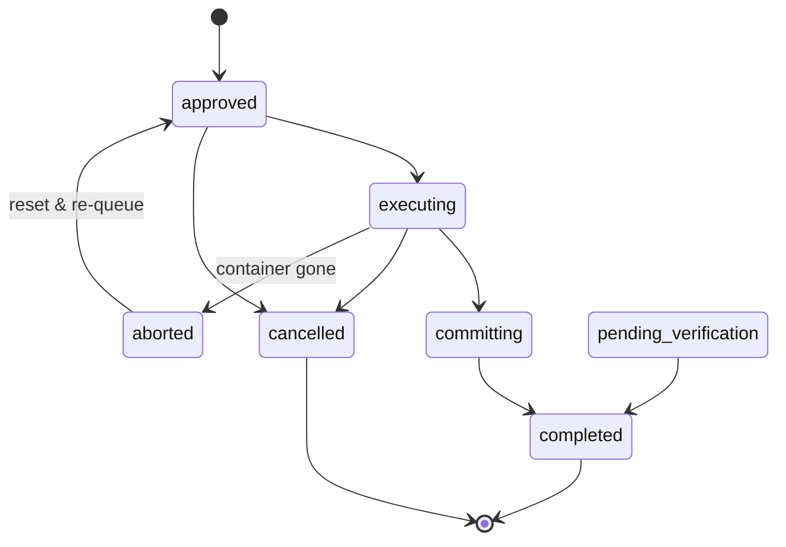

# Architecture & Execution Flow

How dark-factory processes specs and prompts, what runs where, and how each component fits together.

## System Overview

```
┌─────────────────────────────────────────────────────────────────┐
│  HOST (your machine)                                            │
│                                                                 │
│  ┌─────────────┐    ┌──────────────┐    ┌───────────────────┐  │
│  │ Claude Code  │───>│ dark-factory │───>│ Docker Container  │  │
│  │ (interactive)│    │   (daemon)   │    │  (YOLO agent)     │  │
│  └─────────────┘    └──────────────┘    └───────────────────┘  │
│                            │                      │             │
│  You write specs/prompts   │ Orchestrates:        │ Implements: │
│  and approve them          │ - git ops            │ - code      │
│  via Claude Code           │ - container lifecycle│ - tests     │
│                            │ - status tracking    │ - docs      │
│                            │ - notifications      │             │
└─────────────────────────────────────────────────────────────────┘
```

**Key boundary:** The YOLO container has NO git access. All git operations (branch, commit, push, PR) happen on the host via dark-factory.

## Choosing a Flow

**Canonical decision lives in [choosing-a-flow.md](choosing-a-flow.md).** Read it. Do not duplicate the decision here — drift across files is what caused historic confusion.

### Why the prompt flow exists at all

The headline reason: **safe unattended execution**. Prompts run inside a YOLO Claude container with permission checks disabled, sandboxed from the host. You queue work, step away from the machine, and come back to commits — no "Approve this Bash command?" interruptions. Interactive Claude Code blocks on every tool call; dark-factory removes that friction for mechanical work the agent can do without your judgment in the loop.

Once you have that, the rest follows:

- **Documentation** — committed prompts and specs survive long after the implementation context is gone. Future readers answer "what changed and why" from the artifact, not by reverse-engineering a diff.
- **Decomposition** (specs only) — writing a spec forces you to think through edge cases, failure modes, and acceptance criteria before code exists. Surfaces design errors cheaply.
- **Token savings** — dark-factory containers run Sonnet for implementation; interactive Claude Code sessions run Opus. Mechanical work flows to the cheaper model.

## End-to-End Flow

### Phase 1: Spec → Prompts (Host, Interactive)

```
Human + Claude Code                    dark-factory daemon
       │                                      │
  1. Write spec                               │
  2. Audit spec (/audit-spec)                 │
  3. Approve spec ──────────────────────>  4. Auto-generate prompts
       │                                      │
  5. Review generated prompts                 │
  6. Audit prompts (/audit-prompt)            │
  7. Approve prompts ──────────────────>  8. Queue for execution
```

### Phase 2: Prompt Execution (Host + Container)

This is the core loop. For each queued prompt, dark-factory runs these steps:

```
 STEP  WHERE        WHAT HAPPENS
 ────  ─────        ────────────
  1    Host         Git fetch + merge origin/default
  2    Host         Load prompt file, read body content
  3    Host         Assemble final prompt (see "Prompt Assembly" below)
 3.5  Host         Preflight baseline check (preflightCommand in container, cached by HEAD SHA)
  4    Host         Setup workflow (branch switch or clone)
  5    Host         Start Docker container with assembled prompt
  6    Container    YOLO agent reads prompt and implements changes
  7    Container    Agent runs validationCommand (e.g., make precommit)
  8    Container    Agent self-evaluates against validationPrompt criteria
  9    Container    Agent writes DARK-FACTORY-REPORT completion marker
 10    Host         Parse completion report from container logs
 11    Host         Validate report (success/partial/failed)
 12    Host         Move prompt to completed/
 13    Host         Git commit (push gated on autoRelease; tag gated on CHANGELOG.md; or PR creation)
 14    Host         Auto-complete linked spec if all prompts done
 15    Host         Notify (Telegram/Discord) if attention needed
```

### Phase 3: Post-Execution (Host)

```
Direct workflow:     commit → (push if autoRelease) → (tag + push tag if CHANGELOG.md)
Branch workflow:     commit → push branch → (last prompt?) → merge to default → release
PR workflow:         commit → push branch → create/update PR → (autoMerge?) → merge
```

`autoRelease` (any-to-push) and `CHANGELOG.md` (presence-to-tag) are orthogonal: see [configuration.md](configuration.md) and [release-process.md](release-process.md).

## Preflight Failure Policy

Dark-factory is the **sole writer** of the working tree while it runs. It cannot repair its own preflight failure (formatter errors, missing mocks, build breaks, dep bumps all need a human or external tool). A parallel fix while the daemon loops is unsafe: the daemon may catch the tree in a transient-green state mid-edit and start executing prompts against files the human is still changing — a clobbering race.

**Rule:** preflight failure is terminal. Daemon and one-shot `run` exit non-zero with a clear cause. No retry, no skip-and-continue. Human fixes the tree, then explicitly restarts dark-factory. This preserves the sole-writer invariant.

The **healthcheck startup gate** (daemon-only) follows the same terminal policy: on
`dark-factory daemon` start it runs the healthcheck probe sequence once before the watch
loop. A gate failure exits the daemon non-zero with a category-naming cause (e.g.
`healthcheck failed: docker daemon unreachable`) and fires a notification — no retry, no
skip-and-continue. Successful results are cached for `healthcheckInterval`; failures are
never cached, so an operator fix is re-checked on the next start. The gate is disabled with
`healthcheckEnabled: false` and bypassed for one run with `--skip-healthcheck`.

## Prompt Assembly

Dark-factory assembles the final prompt the agent receives by appending sections to the original prompt body. This happens on the host **before** the container starts.

```
┌──────────────────────────────────┐
│  Original prompt body            │  ← What the human/generator wrote
│  (from prompts/in-progress/)     │
├──────────────────────────────────┤
│  Completion Report Suffix        │  ← Always appended
│  (DARK-FACTORY-REPORT format)    │    Tells agent how to report results
├──────────────────────────────────┤
│  Changelog Suffix                │  ← Only if CHANGELOG.md exists
│  (write ## Unreleased entry)     │    Tells agent to update changelog
├──────────────────────────────────┤
│  validationCommand Suffix        │  ← Only if validationCommand is set
│  (e.g., "run make precommit")   │    Overrides <verification> section
│                                  │    Agent runs this command
├──────────────────────────────────┤
│  validationPrompt Suffix         │  ← Only if validationPrompt is set
│  (AI quality criteria)           │    Agent self-reviews its own changes
│                                  │    against these criteria AFTER
│                                  │    validationCommand passes
└──────────────────────────────────┘
```

### Execution order inside the container

```
1. Agent implements all requirements from the prompt body
2. Agent runs validationCommand (e.g., make precommit)
   └── If exit code != 0 → report "failed", stop
3. Agent reads validationPrompt criteria
   └── Checks each criterion against its own changes
   └── Unmet criteria → report "partial" with blockers
   └── All met → report "success"
4. Agent writes DARK-FACTORY-REPORT with status + summary
```

**Important:** `validationCommand` is a shell command the agent runs (machine-judged, exit code). `validationPrompt` is text the agent reads and evaluates its work against (AI-judged, self-review). They are complementary — validationCommand catches build/lint failures, validationPrompt catches quality/completeness gaps.

## Status Lifecycle

### Prompt Status

```
created → approved → executing → committing → completed
                         │            │             │
                         └── failed   └── (retry)   └── (moved to completed/)
                         │
                         └── partial (validationPrompt criteria unmet)
```

### Prompt State Machine

`pkg/promptstate` is the **single owner** of prompt-state interpretation. It reads four observable inputs — filesystem location, frontmatter status, container field, and Docker state — and returns the authoritative `State` via `InterpretTuple`. The boundary is enforced by `make hotpath-statemachine-check` (wired into precommit), which fails the build if a consumer re-derives state inline instead of calling `InterpretTuple`.

**Seven canonical states:**

| State | On-disk value | Meaning |
|-------|--------------|---------|
| `StateApproved` | `approved` | Queued, not yet executing. |
| `StateExecuting` | `executing` | Running in a container, or being resumed into one. |
| `StateCommitting` | `committing` | Container succeeded; git commit pending. |
| `StateCompleted` | `completed` | Finished and located in the completed dir. |
| `StateCancelled` | `cancelled` | Cancelled before or during execution (terminal). |
| `StatePendingVerification` | `pending_verification` | Awaiting post-review verification. |
| `StateAborted` | *(none — transient/interpreted)* | Frontmatter says `executing` but the container is gone; the daemon resolves by resetting to `approved`. No on-disk value. |

`StateUnknown` (`unknown`) is the error-only sentinel returned for unrecognised status strings. The daemon logs `unknown_prompt_status` and surfaces the prompt as `unknown`; it never silently coerces.

**Allowed transitions** (locked by `stateTransitions` in `pkg/promptstate/transitions.go`):



**Recovery edges** (locked by regression tests in `pkg/promptstate`):

1. **Resume stays executing** — `executing` + container running → `StateExecuting`. Docker-unavailable also stays `StateExecuting` (refuse to coerce; file truth wins).
2. **Executing → aborted** — `executing` + container gone (stopped) → `StateAborted`; daemon resets to `StateApproved` and re-queues.
3. **Committing → completed** — `committing` + file in `prompts/in-progress/` → `StateCommitting`, then follows the normal `Committing → Completed` transition on commit.
4. **Half-state location wins** — `committing` + file already in `prompts/completed/` → `StateCompleted` directly (PR #30 half-state: file moved before status updated; location wins over the stale on-disk status).

### Spec Status

```
draft → approved → prompted → verifying → completed
                       │           │
                       │           └── (human runs dark-factory spec complete)
                       └── (all prompts auto-generated)
```

## Directory Structure

```
project/
├── .dark-factory.yaml          # Configuration
├── .dark-factory.lock          # Instance lock (flock-based)
├── CLAUDE.md                   # Agent context (read by YOLO container)
├── CHANGELOG.md                # Version history (optional)
├── docs/
│   └── dod.md                  # Definition of Done (validationPrompt target)
├── prompts/
│   ├── my-change.md            # Inbox (status: draft)
│   ├── in-progress/
│   │   └── 001-my-change.md    # Queue (status: approved/executing/committing)
│   ├── completed/
│   │   └── 001-my-change.md    # Done (status: completed)
│   └── log/
│       └── 001-my-change.log   # Execution log + completion report
├── specs/
│   ├── my-feature.md           # Inbox (status: draft)
│   ├── in-progress/
│   │   └── 033-my-feature.md   # Active (status: approved/prompted/verifying)
│   ├── completed/
│   │   └── 033-my-feature.md   # Done (status: completed)
│   └── log/
└── scenarios/                  # End-to-end verification scenarios
```

## What Runs Where

| Component | Runs on | Responsibility |
|-----------|---------|---------------|
| Claude Code | Host (interactive) | Write specs/prompts, audit, approve |
| dark-factory daemon | Host (background) | Orchestrate: watch queue, manage containers, git ops, notifications |
| dark-factory CLI | Host (interactive) | `approve`, `retry`, `status`, `list`, `complete` |
| YOLO container | Docker (isolated) | Implement code changes, run tests, self-evaluate quality |
| Git operations | Host only | Fetch, branch, commit, push, PR create/merge |
| preflightCommand | Docker container | Verify baseline before prompt; same image as YOLO, cached by HEAD SHA |
| validationCommand | Inside container | Agent runs shell command (e.g., `make precommit`) |
| validationPrompt | Inside container | Agent self-reviews work against quality criteria |
| Notifications | Host | Telegram/Discord via HTTPS from daemon |

## Workflow Modes

| `workflow` | `pr` | Git behavior | Container sees |
|------------|------|--------------|----------------|
| `direct` (default) | `false` | Commit to current branch in-place | Parent repo (real `.git/`) |
| `branch` | `false`/`true` | New branch in parent repo, optional PR | Parent repo on new branch |
| `worktree` | `false`/`true` | `git worktree add` under `/tmp/dark-factory/`, optional PR | Worktree files (`.git` masked — no git in container) |
| `clone` | `false`/`true` | Fresh clone under `/tmp/dark-factory/`, optional PR | Cloned repo (real `.git/`) |

`workflow: direct` + `pr: true` is rejected (no feature branch to open a PR from). See [workflows.md](workflows.md) for the full matrix and choosing a mode.

## Configuration Reference

See [configuration.md](configuration.md) for all config fields and examples.
