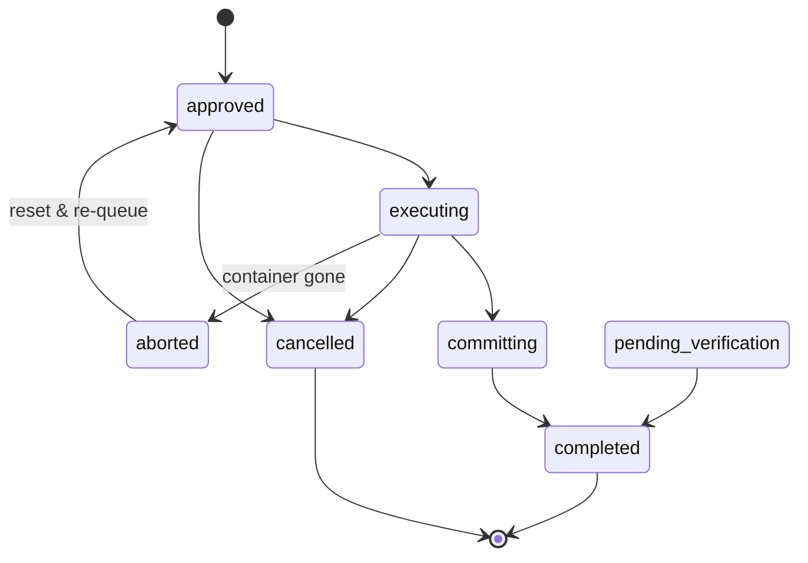

<summary>

- Adds a "Prompt State Machine" subsection to the architecture documentation that names all seven prompt states, including the previously-undocumented "pending verification" state.
- Includes a diagram (mermaid state diagram) showing the allowed transitions between states, including the recovery edges that recent bug fixes hardened (resume-stays-executing, container-gone-aborts, committing-to-completed, and the half-state where a file already in the completed dir resolves as completed).
- Explains that one package now owns the interpretation of a prompt's observable inputs into its authoritative state, and points readers to the precommit gate that keeps that boundary intact.
- Closes the doc/code drift the spec called out: the diagram now matches what the code actually does.
- Pure documentation change — no code, no behaviour change.

</summary>

<objective>
Add a "Prompt State Machine" subsection to `docs/architecture-flow.md` that names all seven canonical prompt states (including `pending_verification`), shows the allowed transitions and recovery edges as a mermaid diagram, and points readers at `pkg/promptstate` as the single owner and at the `hotpath-statemachine-check` gate. This captures the finished state machine and closes the doc/code drift the spec flagged.
</objective>

<context>
Read `/home/node/.claude/CLAUDE.md` first, then `/workspace/CLAUDE.md`.

Read these coding-plugin docs (in-container paths):
- `/home/node/.claude/plugins/marketplaces/coding/docs/documentation-guide.md` — doc structure/style.
- `/home/node/.claude/plugins/marketplaces/coding/docs/changelog-guide.md` — changelog format.

Read the parent spec end-to-end:
- `/workspace/specs/in-progress/101-extract-unified-prompt-state-machine.md` — Desired Behavior items 4, 5; Acceptance Criteria 8, 9.

Prompts 1 and 3 MUST be on the tree (the `State` enum and `pending_verification` first-class). If `pkg/promptstate/state.go` is absent, STOP and report `Status: failed` with message "pkg/promptstate not yet deployed (prompt 1)".

Read these source files END-TO-END before writing (so the diagram matches the CODE, not guesswork):
- `/workspace/pkg/promptstate/state.go` — the seven canonical `State` constants and `AvailableStates`. The diagram MUST name exactly these (plus note `StateUnknown` as the error sentinel).
- `/workspace/pkg/promptstate/transitions.go` — the `stateTransitions` table. The diagram's edges MUST match this table EXACTLY (every row → one or more arrows). Do not invent edges; do not omit edges.
- `/workspace/pkg/promptstate/interpret.go` — the `InterpretTuple` rules, especially the four recovery edges, so the doc's prose describing recovery matches the code.
- `/workspace/docs/architecture-flow.md` — esp. the `## Status Lifecycle` section (line 146) which currently has a `### Prompt Status` ASCII block (line 148) and a `### Spec Status` block. Decide placement: add the new `### Prompt State Machine` subsection INSIDE `## Status Lifecycle`, immediately after the existing `### Prompt Status` block (line ~157) and before `### Spec Status`. This keeps it next to the related content. Do NOT delete the existing `### Prompt Status` ASCII block — augment, do not replace.

VERIFIED FACTS (do not re-derive):
- The seven canonical states (from `pkg/promptstate/state.go`, prompt 1): `StateApproved` ("approved"), `StateExecuting` ("executing"), `StateCommitting` ("committing"), `StateCompleted` ("completed"), `StateCancelled` ("cancelled"), `StatePendingVerification` ("pending_verification"), `StateAborted` ("aborted" — interpreted/transient, no on-disk value). Plus `StateUnknown` ("unknown") — the error sentinel.
- The transition table (from `pkg/promptstate/transitions.go`, prompt 1): `Approved -> {Executing, Cancelled}`; `Executing -> {Committing, Cancelled, Aborted}`; `Committing -> {Completed}`; `Aborted -> {Approved}`; `PendingVerification -> {Completed}`; `Completed` and `Cancelled` are terminal sinks.
- The four recovery edges (from `pkg/promptstate/interpret.go`): (1) executing + container running -> stays Executing; (2) executing + container gone -> Aborted (reset path); (3) committing + file in in-progress dir -> Committing, then -> Completed; (4) committing + file ALREADY in completed dir -> Completed (half-state, location wins).
- AC-8 evidence: `grep -cE 'Approved|Executing|Committing|Completed|Cancelled|PendingVerification|Aborted' docs/architecture-flow.md` >= 7 AND `grep -cE 'pending_verification|PendingVerification' docs/architecture-flow.md` >= 1.
- AC-9 evidence: `grep -nE '```mermaid|stateDiagram|state\s+\w+\s*->' docs/architecture-flow.md` >= 1 line. Using a ```mermaid stateDiagram-v2 block satisfies both `\`\`\`mermaid` and `stateDiagram`.

</context>

<requirements>

## 1. Add the `### Prompt State Machine` subsection

In `/workspace/docs/architecture-flow.md`, inside the `## Status Lifecycle` section, immediately AFTER the existing `### Prompt Status` ASCII block and BEFORE `### Spec Status`, add a new `### Prompt State Machine` subsection containing, in order:

1.1. A one-paragraph intro stating that `pkg/promptstate` is the single owner of prompt-state interpretation: it reads the four observable inputs `(filesystem location, frontmatter status, container field, docker state)` and returns the authoritative `State` via `InterpretTuple`. Name the package and the function. State that the boundary is enforced by `make hotpath-statemachine-check` (wired into precommit), which fails the build if a consumer re-derives state inline.

1.2. A list (or table) of the SEVEN canonical states with a one-line meaning each — naming all seven so AC-8's grep passes. Use the on-disk string values where they exist:
   - `approved` (StateApproved) — queued, not yet executing.
   - `executing` (StateExecuting) — running in a container, or being resumed into one.
   - `committing` (StateCommitting) — container succeeded; git commit pending.
   - `completed` (StateCompleted) — finished and located in the completed dir.
   - `cancelled` (StateCancelled) — cancelled before or during execution (terminal).
   - `pending_verification` (StatePendingVerification) — awaiting post-review verification.
   - `aborted` (StateAborted) — INTERPRETED/transient: frontmatter says executing but the container is gone; the daemon resolves it by resetting to approved. No on-disk value.
   Add a one-line note that `unknown` (StateUnknown) is an error-only sentinel returned for unrecognised status strings (the daemon logs `unknown_prompt_status` and surfaces the prompt as `unknown`, never silently coercing).

1.3. A mermaid state diagram matching `stateTransitions` EXACTLY. Use a fenced ```mermaid block with `stateDiagram-v2`:



Adjust the exact arrows ONLY if `pkg/promptstate/transitions.go` differs from the VERIFIED FACTS table — read the file and match it. Do NOT add edges that are not in the table.

1.4. A short "Recovery edges" paragraph naming the four recovery rules (resume-stays-executing, executing→aborted when container gone, committing→completed, and the half-state where a file already in `prompts/completed/` resolves as `completed` because location wins). Reference that these are locked by regression tests in `pkg/promptstate`.

## 2. Keep the existing content intact

Do NOT delete or rewrite the existing `### Prompt Status` ASCII block or `### Spec Status` block. The new subsection is additive. Preserve the surrounding markdown formatting and heading levels (`###` under the `## Status Lifecycle` `##` heading).

## 3. CHANGELOG

Append to `## Unreleased` in `/workspace/CHANGELOG.md` ONE bullet:

```
- docs: add Prompt State Machine subsection to docs/architecture-flow.md — seven states, mermaid transition diagram, and recovery edges; documents the previously-undocumented pending_verification state (spec 101 prompt 5)
```

</requirements>

<constraints>

- Pure documentation change — no Go code, no behaviour change.
- The diagram MUST match `pkg/promptstate/transitions.go` exactly — read the file; do not invent or omit edges (spec Desired Behavior item 5).
- All seven canonical states MUST be named, and `pending_verification` MUST appear (spec AC-8).
- The subsection MUST include a mermaid/ASCII diagram (spec AC-9).
- Do NOT delete the existing `### Prompt Status` / `### Spec Status` blocks — augment only.
- This is the ONLY prompt that edits `docs/architecture-flow.md` (prompt 4 deliberately leaves it alone) — no merge conflict.
- Do NOT commit — dark-factory handles git.
- If `docs/architecture-flow.md` is referenced by `make check-links`, ensure any added relative links resolve (the subsection need not add links; if it does, verify the target exists).
- Existing tests must still pass (this prompt changes no code; `make precommit` should still pass and `make check-links` must stay green).

</constraints>

<verification>

```bash
cd /workspace

# AC 8 — all seven states named, pending_verification present
grep -cE 'Approved|Executing|Committing|Completed|Cancelled|PendingVerification|Aborted' docs/architecture-flow.md
# expected: >= 7
grep -cE 'pending_verification|PendingVerification' docs/architecture-flow.md
# expected: >= 1

# AC 9 — diagram present
grep -nE '```mermaid|stateDiagram|state\s+\w+\s*->' docs/architecture-flow.md
# expected: >= 1 line

# the new subsection heading exists
grep -n '### Prompt State Machine' docs/architecture-flow.md
# expected: >= 1 line

# existing blocks preserved
grep -nE '^### (Prompt Status|Spec Status)$' docs/architecture-flow.md
# expected: both still present

# CHANGELOG entry present
grep -n 'spec 101 prompt 5' CHANGELOG.md
# expected: >= 1 line

# links + precommit still green
make check-links; echo "links exit=$?"
make precommit
# expected: links exit=0; precommit exit 0
```

</verification>
